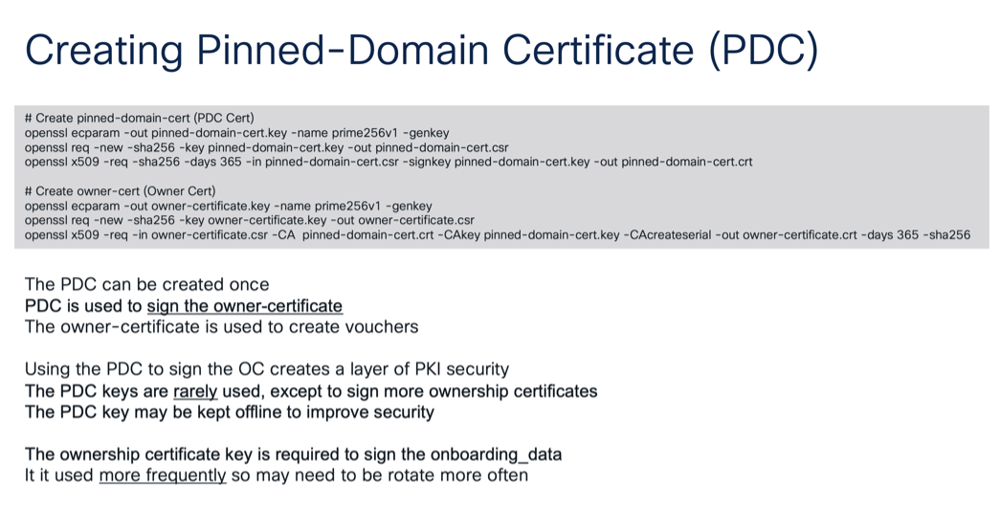
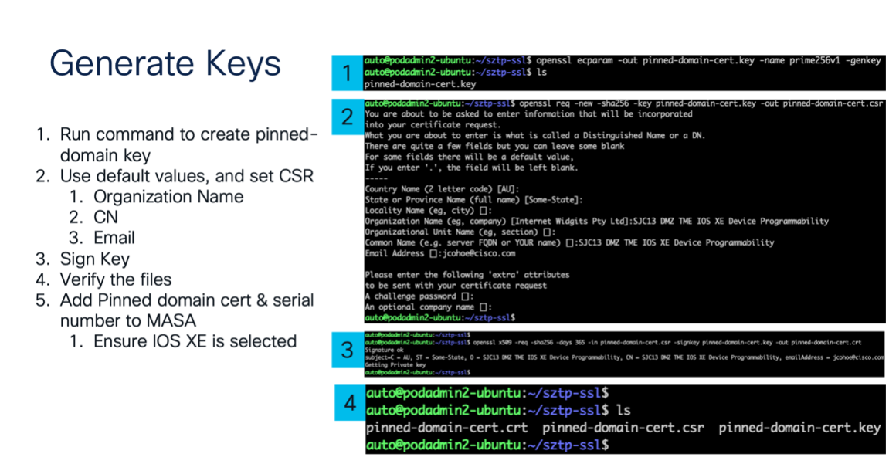
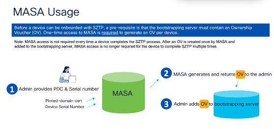
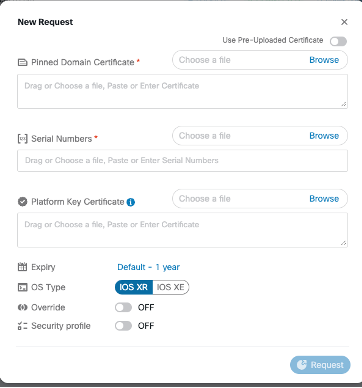

# Secure Zero Touch Provisioning (Secure ZTP or SZTP) with Cisco Catalyst Guide


## Secure Boot

We use secure boot all the time when onboarding new devices. The goal is to ensure that the software installed on our devices is trusted and has not been tampered with or manipulated by an outside adversary. Ultimately, we want to securely onboard devices into our network. The biggest benefit of SZTP is onboarding devices securely. Additionally, a major benefit is that once the SZTP components are properly prepped, a non-technical person can easily rack and stack the device to efficiently bring the device online.

### Secure Zero Touch Provisioning Use cases

1. Onboarding devices that have network access and can reach an external server for bootstrapping data
1. Onboard devices are in an air-gapped network where the bootstrapping server requires all bootstrapping data to be within that network

## SZTP overview

### Components of Secure ZTP 

1. Device (to onboard) – the Cisco Catalyst device will be shipped to customers containing a SUDI Certificate and a SUDI private key. The goal of SZTP is to onboard this device into a pre-existing network
1. Bootstrapping server – a RESTCONF server where all the bootstrapping data is located. This can include the bootstrapping data / artifacts described below. 
    * Note: we will use the IP of the bootstrapping server in the DHCP configuration so newly onboarded devices know where to look for their onboarding information
    * Bootstrapping data / artifacts – the information needed on the bootstrapping server itself for SZTP
        1. Conveyed information - this is part of the bootstrapping data used to encode the redirect / onboarding information such as the scripts to onboard and configure the device
            * Redirect Information – this includes the IP, optional port and optional trust anchor certificate needed to locate the bootstrapping server(s). The redirect information is only trusted if it is either obtained via a secure connection to a trusted bootstrapping server or if it is signed by the device’s owner. Otherwise, it is untrusted.
            * If the onboarding process requires image upgrades, the binary files for those upgrades will be included in the conveyed information
            * Any necessary pre- and post-configuration scripts will be included here as well
    1. Ownership Voucher (OV) – the Base64 encoded key-value pairs are part of the bootstrapping data used to verify a device owner as defined by the manufacturer. The OV contains information about the serial number (burnt onto the device during manufacturing) and the pinned-domain-certificated, managed by the customer.
    1. Ownership Certificate (OC) - this X.509 certificate binds an owner identity to a public key and is part of the bootstrapping data. The device verifies the signature of the conveyed information using the public key in the OC which ensures the conveyed information has not been tampered with and confirms it is from a trusted source.
1. Trust anchor - this is part of the bootstrapping data used to validate the server. In the case of Catalyst devices, the trust anchor is the SUDI certificate burnt onto the device during manufacturing. This certificate is validated using the manufacturer-provided public certificate to validate that the device authenticity.

## How does SZTP work?
### Securely onboard devices by validating the signed data 
End goal: Securely onboard devices by validating the signed data (if provided, the device must follow these steps). Note: if any of these steps fail, the device must invalidate the signed data and it cannot perform any subsequent steps. To validate the signed data, the device must,
1. Authenticate the Ownership Voucher by validating its signature to one of the pre-configured trust anchors
    * If a device has an accurate clock
        1. The device must verify that the Ownership Voucher was created in the past
        1.  If the “expires-on” leaf is present, the device must verify that the voucher has not yet expired
1. Verify the ownership voucher’s “assertion” value is acceptable
1. Verify that the ownership voucher specifies the current device’s serial number
    * If the “idevid-issuer” leaf is present, the device must verify that the value is set correctly
    * If the authentication of the ownership voucher is successful,
        1. The device extracts the “pinned-domain-cert” node, an X.509 certificate, needed to verify the owner certificate
        1. Using the “pinned-domain-cert” the device then authenticates the owner certificate
            * If the ownership voucher’s “domain-vert-revocation-checks” mode’s value is “true,” the device must verify the revocation status of the certificate chain used to sign the owner certificate
                1. If a suitable fresh revocation status is unattainable or if it is determined that a certificate has been revoked, the device must not validate the owner certificate
1. Verify the conveyed information was signed by the validated owner certificate

### Process onboarding information (the  order below must be followed)
1. Boot image (optional)
    * If the device is already running the required boot image, no action is needed
    * If the device is not yet running the required boot image, it must download, verify, install the image and then reboot.
1. Pre-configuration file (optional)
    * If provided, the pre-configuration script must be executed and any capture output or errors. For example, `pre-configuration-script.py` could include code to create a timestamp to help determine how long the SZTP configuration process takes:
        ```
        import subprocess
        import datetime
        with open('/bootflash/guest-share/pre-config-script-output.txt', 'w') as f:
            f.write('This file was created by the pre-configuration script\n')
            now = datetime.datetime.now()
            f.write('Current time: ' + str(now))
        ```
1. Configuration (optional)
    * If provided, the configuration script must be executed and any capture output or errors. For example, `configuration-script.py` can include any code to customize the device configuration. Here is one small example. Many more examples can be found [here](https://github.com/jeremycohoe/IOSXE-Zero-Touch-Provisioning/tree/main)
        ```
        print "\n\n *** Sample ZTP Day0 Python Script *** \n\n"
        # Importing cli module
        import cli

        print "Configure vlan interface, gateway, aaa, and enable netconf-yang\n\n"
        cli.configurep(["int vlan 1", "ip address 10.5.123.27 255.255.255.0", "no shut", "end"])
        cli.configurep(["ip default-gateway 10.5.123.1", "end"])
        cli.configurep(["username admin privilege 15 secret 0 XXXXXXXXXXXXX"])
        cli.configurep(["aaa new-model", "aaa authentication login default local", "end"])
        cli.configurep(["aaa authorization exec default local", "aaa session-id common", "end"])
        cli.configurep(["netconf-yang", "end"])

        print "\n\n *** Executing show ip interface brief  *** \n\n"
        cli_command = "sh ip int brief"
        cli.executep(cli_command)

        print "\n\n *** ZTP Day0 Python Script Execution Complete *** \n\n"
        ```
1. Post-configuration (optional)
    * If provided, the post-configuration script must be executed and any capture output or errors. For example, `post-configuration-script.py` could include code to create a timestamp to help determine how long the SZTP configuration process takes:
        ```
        import datetime
        with open('/bootflash/guest-share/post-config-script-output.txt', 'w') as f:
            f.write('This file was created by the post-configuration script\n')
            now = datetime.datetime.now()
            f.write('Current time: ' + str(now))
        ```


### SZTP Pre-requisites (setup done by the admin to ensure onboarding occurs properly)
1. Configure DHCP
    * Example of DHCP configurtion with Option 143 on a Catalyst device. Note: this DHCP setup must be configured on a separate device from the one that is currently being onboarded:
        ```
        ip dhcp pool SZTP
        network 10.85.134.192 255.255.255.192
        default-router 10.85.134.254
        domain-name vnc2.cisco.com
        dns-server 64.102.6.247
        option 143 hex 001a.6874.7470.733a.2f2f.3137.312e.3730.2e36.322e.3636.3a31.3136.3031
        ```


    * How to create Hex for above config (with script). The following outlines all of the steps needed to generate the hex needed in the example above. You can generate this hex and skip over the following steps by simply running this [script](https://github.com/jeremycohoe/IOSXE-Zero-Touch-Provisioning/blob/main/secure-ztp/convert-option143-uri-to-hex.py)
        1. Convert URI ascii to Hex https://www.rapidtables.com/convert/number/ascii-to-hex.html
            * Text URI: https://sjc-ads-2128.cisco.com:11601
            * Hex URI: 68747470733A2F2F736A632D6164732D323132382E636973636F2E636F6D3A3131363031
        1. Determine HALF of string length: https://codebeautify.org/calculate-string-length
            * 72, half is 36
        1. Convert 36 decimal to hex signed 2 https://www.rapidtables.com/convert/number/decimal-to-hex.html?x=26
            * 00 24
        1. Combine to make option 143 hex string:
            * **0024**68747470733A2F2F736A632D6164732D323132382E636973636F2E636F6D3A3131363031
        1. Create, manage and maintain pinned-domain certificate (PDC). Described in the next step
1. Create pinned-domain-cert (PDC Cert)
    ```
    openssl ecparam -out pinned-domain-cert.key -name prime256v1 -genkey

    openssl req -new -sha256 -key pinned-domain-cert.key -out pinned-domain-cert.csr

    openssl x509 -req -sha256 -days 365 -in pinned-domain-cert.csr -signkey pinned-domain-cert.key -out pinned-domain-cert.crt
    ```
    
    
1.  Create owner-cert (Owner Cert)
    ```
    openssl ecparam -out owner-certificate.key -name prime256v1 -genkey

    openssl req -new -sha256 -key owner-certificate.key -out owner-certificate.csr

    openssl x509 -req -in owner-certificate.csr -CA pinned-domain-cert.crt -CAkey pinned-domain-cert.key -CAcreateserial -out owner-certificate.crt -days 365 –sha256

    ```
    Generate keys, sign keys & create OV

    

1. Create Ownership Voucher
    * Use PDC and device serial number to create OV using Cisco’s MASA server which can be found at masa.cisco.com. Below, you will find the steps to add PDC & serial number to MASA
    

    1. On your local device, create a PDC using OpenSSL see an example here https://stackoverflow.com/questions/10175812/how-to-generate-a-self-signed-ssl-certificate-using-openssl
    
        ``` 
        openssl req -x509 -newkey rsa:4096 -keyout key.pem -out cert.pem -sha256 -days 365
        ```

        * A cert.pem and key.pem will be created
    1. Login to masa.cisco.com using CEC credentials
    1. Click on the green “New Request” button in the top right corner
         
    1. The Pinned Key Certificate will be the cert.pem that was just generated
    1. The Serial Number is associated with a single Cisco device
    1. For IOS XE, a Platform Key Certificate is not needed
    1. Toggle the OS type to IOS XE and note that Platform Key Certificate is grey-ed out
    1. Make any other changes as desired and then request the cert
    
    1. MASA will provide a downloadable `.vcj` file that will act as the Ownership Voucher. The title of the file will be the serial number of the device itself. This OV now needs to be added to the bootstrapping server.

## Conclusion
1. Which components are maintained by the customer vs by Cisco
    * Customer (you)
        1. Bootstrapping server
        1. Pinned-domain-cert (PDC) - this can be reused for onboarding many devices
        1. Onboarding data
        1. Scripts for configuration (pre-, post- & actual config)
        1. OV – use serial number & PDC (note, there will be one OV per device to onboard since it is tied to the device serial number)
    * Cisco
        1. Created & burnt onto Catalyst device at manufacturing
        1. Serial number
        1. SUDI certificate
        1. SUDI private key
        1. Cisco IOS XE SZTP support starting in 17.11.1+
        1. MASA server – to create an Ownership Voucher per device to onboard, provide a PDC and the serial number to MASA. Then, you will need to add this OV to the bootstrapping server.

### FAQ
1. Is DHCP secured?
    * No, DHCP is completely untrusted in this workflow. https://github.com/opiproject/sztp/blob/main/ZTP.md#discovery
1. Which DHCP option is used for SZTP?
    * 143 for IPv4
    * 136 for IPv6
1. How does the device know where to go to get DHCP info?
    * Example DHCP config to point to the bootstrapping server: option sztp-redirect-urls \"https://redirecter:8080/restconf/operations/ietf-sztp-bootstrap-server:get-bootstrapping-data\";
1. What’s in the Ownership Voucher (OV)?
    * The Base64 encoded key-value pairs contain information about the serial number (burnt onto the device during manufacturing) and the pinned-domain-certificated, managed by the customer. This is stored on the Bootstrapping Server
1. What do we get from MASA?
    * The signed Ownership Voucher (OV). For MASA to provide this to us during onboarding, we need to setup MASA with our PDC and the device’s serial number before the onboarding process begins.
1. What’s included in the redirect information?
    * The bootstrapping server location including the address, optional port and optional trust anchor
1. Why would I have multiple bootstrapping servers in the bootstrapping server list?
    * Multiple bootstrapping servers ensure redundancy and reliability. A redirect server can provide a list of bootstrapping servers to a device, allowing the device to attempt bootstrapping from any server in the list. This setup helps in scenarios where a particular server might be unavailable or unable to provide the necessary bootstrapping data. The recursive algorithm used in Secure ZTP iterates over these servers until valid bootstrapping data is received and successfully applied, or the list of servers is exhausted. This approach enhances the robustness of the provisioning process.
1. Is MASA required for SZTP with Cisco devices?
    * Yes, MASA is required for SZTP with Cisco devices because it creates the necessary Ownership Voucher connecting the PDC to the device's serial number.
1. Does MASA require an on-prem deployment?
    * No, MASA does not require on-prem deployment as it is a cloud-based service that can be reached with a Cisco login at masa.cisco.com
1. Does the SZTP server forms a connection to cloud MASA?
    * The SZTP bootstrapping server does not need to connect directly to MASA. MASA is required for a one-time process (per device onboarded) to generate OVs. Either the MASA GUI or a MASA REST API call can generate the OV and then that OV will need to be added to the bootstrapping server

### Resources
1. SZTP blog: https://blogs.cisco.com/developer/secureztp01
1. RFC8572: https://datatracker.ietf.org/doc/html/rfc8572